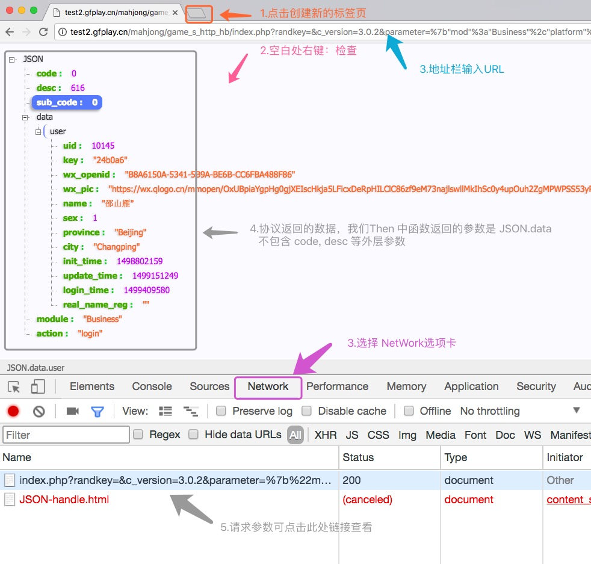
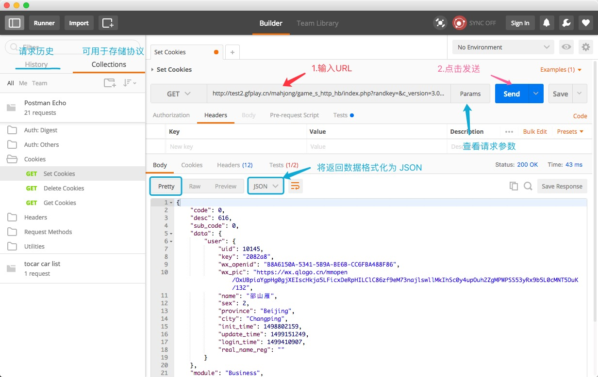

# Chrome 贴士

## 调试 HTTP

eg: 

```
http://test2.gfplay.cn/mahjong/game_s_http_hb/index.php?randkey=&c_version=3.0.2&parameter=%7b%22mod%22%3a%22Business%22%2c%22platform%22%3a%22gfplay%22%2c%22act%22%3a%22login%22%2c%22access_token%22%3a%22foo%22%2c%22openid%22%3a%22B8A6150A-5341-5B9A-BE6B-CC6FBA488F86%22%2c%22type%22%3a1%7d
```
### Chrome + JSON-handle

1. 打开新的标签页
2. 右键：`检查` 或者 `option` + `cmd` + `i`(Mac) / `ctrl` + `alt` + `i` (Windows)
3. 在下方弹出的调试工具中点选 `Network` 选项卡
4. 地址栏输入请求地址
5. 页面出现返回数据
6. 点击下方链接查看详细请求参数
  * Headers - 最下方有请求参数
  * Preview - 是格式化后的JSON



### PostMan



## 查看 JSON

### JSON-handle

安装完成后，浏览器右上角会有图标。点击图标在弹出的输入框中粘贴需要格式化的字符串


### 在线解析

## 正则


1. 打开调试工具，`Console` 中输入代码（执行环境为JS）
2. [RegExr](http://regexr.com/)


## 插件

ps: Chrome 应用商店需要[翻墙](https://github.com/getlantern/lantern)


- [Octotree](https://chrome.google.com/webstore/detail/octotree/bkhaagjahfmjljalopjnoealnfndnagc?hl=en-US) 生成 github 开源项目的目录

- [JSON-handle](https://chrome.google.com/webstore/detail/json-handle/iahnhfdhidomcpggpaimmmahffihkfnj?hl=zh-CN) 格式化 JSON

- [PostMan](https://chrome.google.com/webstore/detail/postman/fhbjgbiflinjbdggehcddcbncdddomop?hl=zh-CN) 协议调试工具

- [Momentum](https://chrome.google.com/webstore/detail/momentum/laookkfknpbbblfpciffpaejjkokdgca)

- [Markdown Preview Plus](https://chrome.google.com/webstore/detail/markdown-preview-plus/febilkbfcbhebfnokafefeacimjdckgl) markdown 预览，可以换主题。安装完之后要勾选允许读取文件的权限