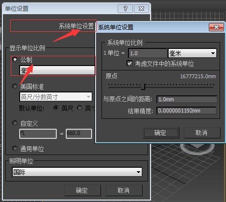
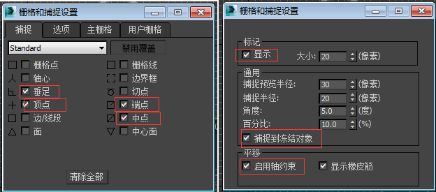
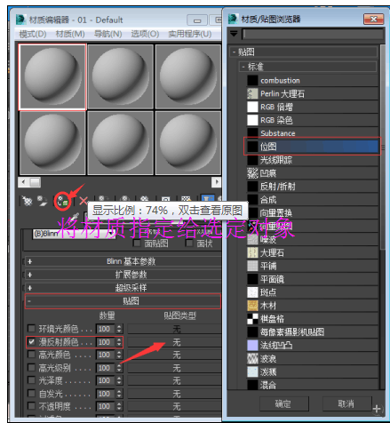
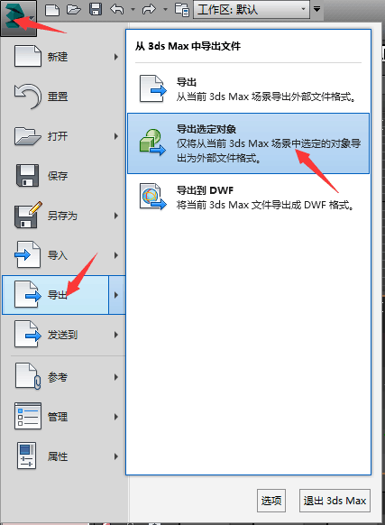
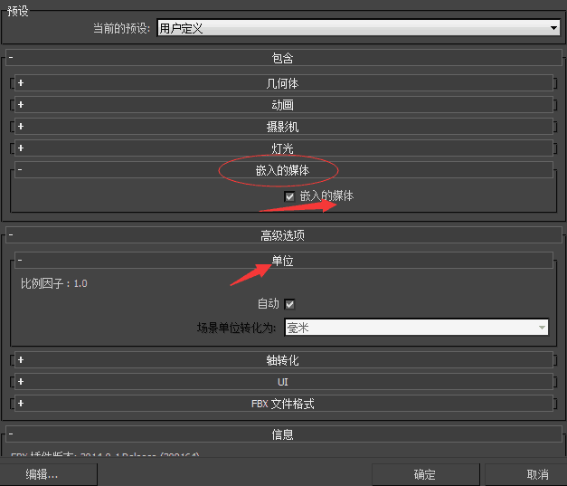

# 3ds-max

>  3D Studio Max，常简称为3d Max，是一款基于PC系统的三维动画渲染和制作软件。

### 安装

 [下载地址](http://www.3dmax8.com/3dmax/ruanjian/3dmax/) 
安装及激活地址 [http://www.3dmax8.com/3dmax/2013/0406/5353_3.html](http://www.3dmax8.com/3dmax/2013/0406/5353_3.html)

1. 下载相应版本的软件及注册机（注册机用于激活软件）
2. 激活时断开网络连接

### 设置及界面

####  设置
1. 单位设置：自定义 -> 单位设置是 -> 公制、系统单位设置 分别设置为毫米  

 

2. 栅格与捕捉：
 捕捉开关 -> 左键按住 勾选2.5
 捕捉开关 -> 右键 -> 栅格与捕捉设置 -> 捕捉（勾选 垂足、顶点、端点、中点）
 捕捉开关 -> 右键 -> 栅格与捕捉设置 -> 选项（显示、捕捉到冻结对象、使用轴约束） 也可将角度调至90度 
3、快捷键的设置：自定义 -> 自定义用户界面（设置快捷键）
 

 

#### 界面
标题栏、菜单栏、工具栏、命令面板、绘图区域、视图控制区、动画控制区

###  常用快捷键 （部分）
视图切换  
- `T` ——切换到顶视图 
- `B` ——切换到底视图 
- `F` ——切换到前视图 
- `P` ——切换到透视图 
- `C` ——切换到摄像机视图 

- `Ctrl + A` ——选择所有物体
- `Alt + A` ——使用对齐（Align）工具

- `I`  ——平移视图到鼠标中心点  
- `N`  ——打开自动（动画）关键帧模式  
- `Ctrl + P` ——平移当前视图  
- `Shift + Q` ——快速渲染  
- `W` ——移动模式  
- `Alt + W`  ——最大化当前视图（开关） 
- `Alt + 鼠标中键`  ——旋转 
- `G` ——删除视图中的栅格 

## 3DMAX如何贴图
1. 使用快捷键“M”，打开“材质编辑器”，选中材质球
2. 找到“贴图”，点击“贴图”—勾选“漫反射颜色”—点击“无”—打开“材质/贴图浏览器”—双击“位图”—选中一张你要贴图的图片—点击“打开”
3. 点击要要上贴图的物体 然后再点击“将材质指定给选定对象”

 

## 3DMAX模型导入到Unity3D的步骤
1. 选中模型，点击左上角3DMAX图标菜单 -> 导出 -> 导出选定对象 
注意： 导出格式为.fbx且名称必须为英文字母类
2. 在Unity中打开，将导出的模型复制到Unity项目所在文件夹中的Assets文件夹下，鼠标拖动模型到场景中，按键F， 物体自动放大 

 

## 导出时的设置
1. 包含 -> 嵌入的媒体（勾选、影响贴图） 
2. 高级选项中 -> 比例因子（根据情况选取） 

  

[详细的参数设置](https://www.autodesk.com/cn/3dsmax/2012help/index.html?url=files/GUID-4B61C2E7-3041-4A8A-852F-D086DE9E66A-2679.htm,topicNumber=d28e513115)
